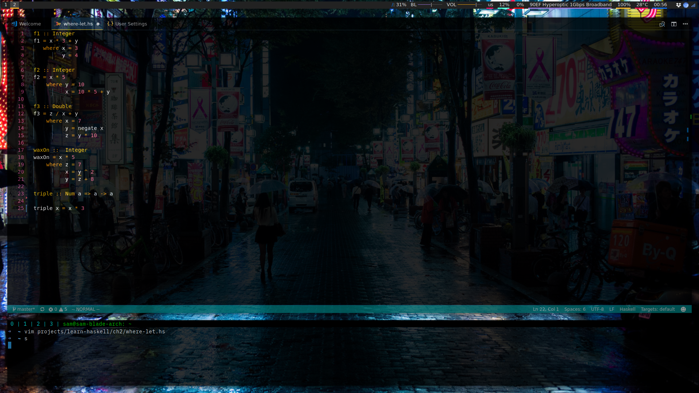

# My VS Code settings



## Transparency

I use Compton for transparency and have the following rule in my compton.conf:

```
opacity-rule = [
  "85:class_g = 'Code' && !_NET_WM_STATE@:32a",
  "0:_NET_WM_STATE@:32a *= '_NET_WM_STATE_HIDDEN'"
];
```

This makes Code transparent without displaying underlying windows if tabbed. The
result is what you'd get using fake transparency in a terminal.

## System
I'm running Arch with i3-gaps and polybar. The terminal underneath is URxvt.
